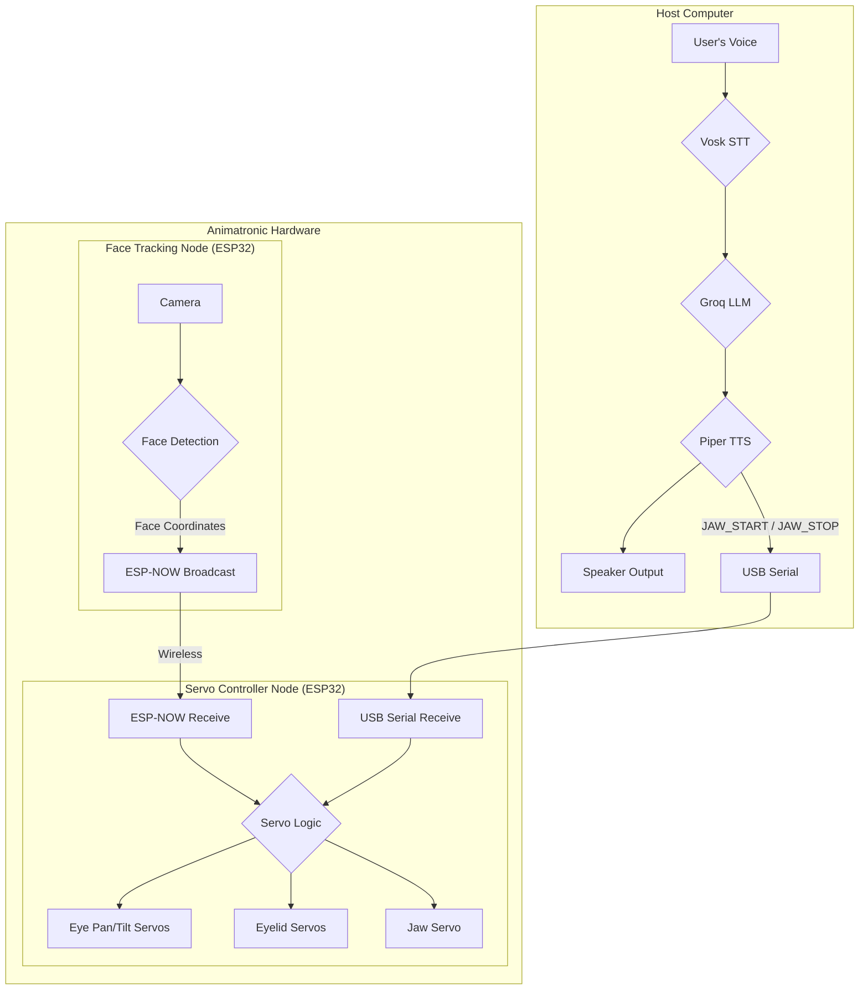

# Animatronic Facial Assistant with Vision-Guided Movements

<p align="center">
  
  
  
</p>

<p align="center">
  A cutting-edge animatronic system that combines <b>real-time face tracking</b>, <b>LLM-powered conversations</b>, and <b>vision-guided servo movements</b> to bring a robotic skull to life.
</p>

---

**This project brings together computer vision, robotics, and large language models to create "Skully," an interactive and expressive animatronic character.** Skully can see and track faces, engage in spoken conversations, and move its eyes and jaw in a surprisingly lifelike manner.

It's a perfect playground for anyone interested in robotics, character animation, or creative AI applications.

<!-- TODO: Add a cool GIF or image of the animatronic in action here! -->
<!-- <p align="center">
  
</p> -->

## ✨ Features

*   🗣️ **Conversational AI:** Powered by **Groq** for incredibly fast LLM responses, enabling natural, low-latency conversations.
*   👁️ **Vision-Guided Eye Tracking:** The eyes follow detected faces in real-time, creating a compelling illusion of focus.
*   👄 **Speech-Synchronized Jaw:** The jaw moves realistically as the animatronic speaks, driven by the TTS audio stream.
*   🤖 **Dynamic Eyelid Movements:** Features automatic blinking and subtle eyelid adjustments based on eye position, adding a layer of realism.
*   🔌 **Modular & Extensible:** Built with a decoupled architecture (ESP-NOW for wireless inter-chip communication, Serial for PC-to-chip), making it easy to modify and expand.
*   🔧 **Highly Customizable:** Easily tune servo limits, swap out LLM models, change the AI's personality, and adapt for your own hardware.

## 🛠️ System Architecture

The system is built from three core components that work in concert:

1.  **🧠 The Brain (LLM Voice Agent):** A Python application running on a host computer. It handles:
    *   **STT (Speech-to-Text):** `Vosk` listens to your voice.
    *   **LLM Reasoning:** `Groq` processes the input and generates a response.
    *   **TTS (Text-to-Speech):** `Piper` vocalizes the response.
    *   **Jaw Control:** Sends serial commands to the Servo Controller to animate the jaw.

2.  **👀 The Eye (Face Tracking Node):** An ESP32 with a camera.
    *   Captures video and uses an onboard model to detect faces.
    *   Calculates the face's position and size.
    *   Broadcasts this data wirelessly via **ESP-NOW**.

3.  **🏃‍♂️ The Body (Servo Controller Node):** A second ESP32 connected to the servos.
    *   Receives face data from "The Eye".
    *   Moves the eye pan/tilt servos to track the face.
    *   Controls the automatic blinking and eyelid system.
    *   Listens for serial commands from "The Brain" to move the jaw.



## ⚙️ Getting Started

### 1. Hardware Prerequisites

You'll need the following components:
*   A host computer (e.g., a laptop or Raspberry Pi) to run the Python LLM agent.
*   **Face Tracking Node:**
    *   ESP32 with a camera (e.g., an Adafruit MEMENTO).
*   **Servo Controller Node:**
    *   A standard ESP32 (e.g., an ESP32-DevKitC).
    *   PCA9685 16-Channel Servo Driver.
    *   Servos for eye pan, eye tilt, eyelids, and jaw.
*   A microphone and speaker for the LLM agent.
*   A USB cable for serial communication and power.

### 2. Software Prerequisites

*   [Python 3.9+](https://www.python.org/downloads/)
*   [PlatformIO](https://platformio.org/install): The IDE or Core CLI for building and uploading the ESP32 firmware.
*   A [Groq API Key](https://console.groq.com/keys).

### 3. Step-by-Step Installation

#### Part A: The LLM Voice Agent (The Brain)

This component handles the conversational AI.

1.  **Navigate to the Agent Directory:**
    ```bash
    cd src/LLM_voice_Agent_node
    ```

2.  **Set Up a Virtual Environment:**
    ```bash
    python3 -m venv virEnv
    source virEnv/bin/activate
    ```
    *(On Windows, use `virEnv\Scripts\activate`)*

3.  **Install Python Dependencies:**
    ```bash
    pip install -r requirements.txt
    ```

4.  **Configure Your API Key:**
    Create a file named `.env` in the `src/LLM_voice_Agent_node/` directory and add your Groq API key:
    ```
    GROQ_API_KEY="YOUR_GROQ_API_KEY_HERE"
    ```

#### Part B: The Embedded Firmware (The Eyes & Body)

This firmware controls the animatronic's hardware. You'll need to upload code to both ESP32s.

1.  **Determine Your Servo Controller's MAC Address:**
    *   Upload a simple sketch to your Servo Controller ESP32 to get its MAC address (e.g., use the `WiFi/GetChipID` example in Arduino IDE). You will need this for the next step.

2.  **Configure and Upload the Face Tracker Firmware:**
    *   Open `Face Tracking/Platformio_memento_camera_node/src/main.cpp`.
    *   Update the `receiverMacAddress` array with the MAC address of your Servo Controller ESP32.
    *   Using PlatformIO, build and upload the project to your camera-equipped ESP32.
    ```bash
    # From the project root
    cd Face\ Tracking/Platformio_memento_camera_node
    pio run --target upload
    ```

3.  **Upload the Servo Controller Firmware:**
    *   Using PlatformIO, build and upload the project to your servo-driving ESP32.
    ```bash
    # From the project root
    cd src/Servo_controller_esp32_node
    pio run --target upload
    ```

### 4. Run the System!

1.  Connect both ESP32s to power.
2.  Connect the Servo Controller ESP32 to your host computer via USB.
3.  Launch the LLM Voice Agent:
    ```bash
    # From the src/LLM_voice_Agent_node directory, with venv activated
    python3 main.py
    ```

You should see "🎙️ Listening..." and "✅ Serial connected to animatronic". The system is now live!

## 🧑‍🔧 Making It Your Own

This project is designed to be a starting point. Here’s how you can customize it:

### Changing the AI's Personality

*   Simply edit the `SYSTEM_PROMPT` string in `src/LLM_voice_Agent_node/main.py`. Give your animatronic a completely new personality, from a grumpy pirate to a cheerful assistant!

### Tuning Servo Movements

*   **Servo Limits:** The `servos` array in `src/Servo_controller_esp32_node/src/main.cpp` defines the channel, min/max angles, and center position for each servo. Adjust `minAngle` and `maxAngle` to match your hardware's physical limits.
*   **Jaw Animation:** Modify the `JAW_SPEED`, `JAW_STEP`, `JAW_MIN`, and `JAW_MAX` constants in the same file to change how the jaw moves when talking.
*   **Eye Tracking:** The `map()` function in `trackFace()` controls how face coordinates translate to servo angles. Adjust the output range (e.g., `map(incomingData.face_x, 0, 240, 140, 40)`) to change the sensitivity and range of motion.

### Hardware Servo Tests

The `test/` folder contains simple Arduino sketches to test individual servos. Use these to find the ideal movement range for your build before integrating them into the main firmware.
*   `blink_jaw/`
*   `blink_test/`
*   `eyePan_Tilt/`
*   `neck_test/`
*   `servo_limit_testing/`

## 🗺️ Roadmap

*   [ ] Add ROS2 integration for more complex robotics applications.
*   [ ] Introduce depth sensing for better spatial awareness.
*   [ ] Implement GPU-accelerated inference for on-device vision processing.
*   [ ] Create emotion-mapped facial animations based on LLM sentiment analysis.
*   [ ] Develop phoneme-based jaw synchronization for more accurate lip-sync.
*   [ ] Build a web dashboard for real-time tuning and control.

## 📄 License

This project is released under the MIT License. See the `LICENSE` file for details.
